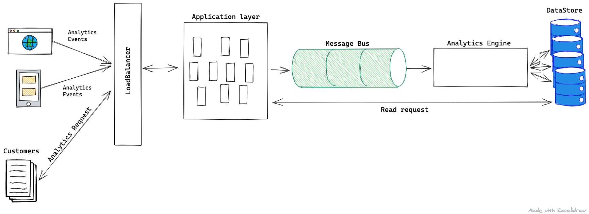

# Coding challenge:

To calculate moving average of N elements, I defined the following:

1. `MovingAverageInterface` - the interface defines three method (`getMovingAverage`, `addElement`, `getElements`), that each concrete class has to implemnet to calculate a moving average and give access to the underlying data structure.

2. `SimpleMovingAverage` class - the class implements `MovingAverageInterface` interface with all required methods. The class uses simple moving average algorithm to calculate moving average of N elements. Source: https://en.wikipedia.org/wiki/Moving_average#Simple_moving_average_(boxcar_filter)

   I used `queue` as an underlying data structure for the algorithm. The reason is `queue` provides efficient opperation on each side of the queue (removing item at the beginning and appending to the end), which fits to the use case of the simple moving average algorigthm.

   In python, queue is effciently implemented by `deque` class by utilizing doubly linkedlist.

3. `TestSimpleMovingAverage` - unit tests for the implmenetation of the SimpleMovingAverage class.

To run unit tests, you will need python 3 (at least 3.7.5). The following command will invoke the tests:

`python simple_moving_average_unittest.py`

# Design

Above is a high level design for an analytics backend system. The system is composed of 4 parts:

## Application layer

The applicaton layer is the entry point for the analytics system. It is repsonsible for ingesting all incoming analytics events and putting them into a message bus. It would also be responsible for providing customers with analytics metrics by reading processed events from the datastore.

Each box in the application layer represents an instance of a service that will recieve analytics events and read queries.
The application layer is fronted by a loadbalancer that would distribute requests among each instance. This architecture would allows us to easily scale the application layer by adding more service instances.

The services at the application layer will expose RESTful APIs to allow various clients to send analytics events. Depending on the message broker, services at the application layer can split events by categories and put them at an approprite queue in the message bus for further processing. The services will also expose RESTful APIs to allow customers to fetch analytics about processed events.

## Message Bus

The message bus is used to support a large volume of writes and is deployed between the application layer and an analytics engine. When the application layer recieves events to ingest, the services would write those events into the message bus for asynchronous processing by the analytics engine.

Depending on features provided by a message bus solution, the events can be split into categeories (such as mobile events, website events, etc.) inside the message bus. This would allow the services at the application layer to publish the incoming events to specific categories and the analytics engine to process events for specific categories.

A popular tool that's used as a message bus is Apache Kafka. It supports a publisher-subscriber paradigm and provides durable and reliable storage in case events have to be reprocessed due to a bug or some other issues at the analytics layer. Kafka can also be scaled up by adding more servers to the cluster to support a higher influx of events.

## Analytics Engine

The analytics engine layer is responsible for processing events coming from various clients and storing them into durable storage.

The analytics engine would read events from the message queue (per category), run batch analytics jobs to provide insigths for customers and store them into the database. If further processing is needed, the engine can read already created analytics from the database and produce more detailed ones based on requirements.

A popular framework for big-data anylatics engine is Apache Spark. It can be used to read events from Apache Kafka and store data in a database.

## Datastore

The datasore layer is responsible for storing aggregated events and insights generated by the analytics engine. The datastore will also be used by the service in the application layer to expose insights to customers.

Due to the requirement to support a large volume of query requests by customers, I would choose a datastore that easily scales and chooses high availability over consistency. By choosing high availability over consistency, we can provide a high throughput system with a trade-off of the system returing stale data to customers from time to time. The data will be eventually consistent and as a result would return correct results to customers over time.

A popular datastore that is eventually consistent, performant, and highly available is Apache Cassandra. The data in a Cassandra cluster is replicated among a configured amount of nodes for durability and the Cassandra cluster can be scaled by adding more nodes.
